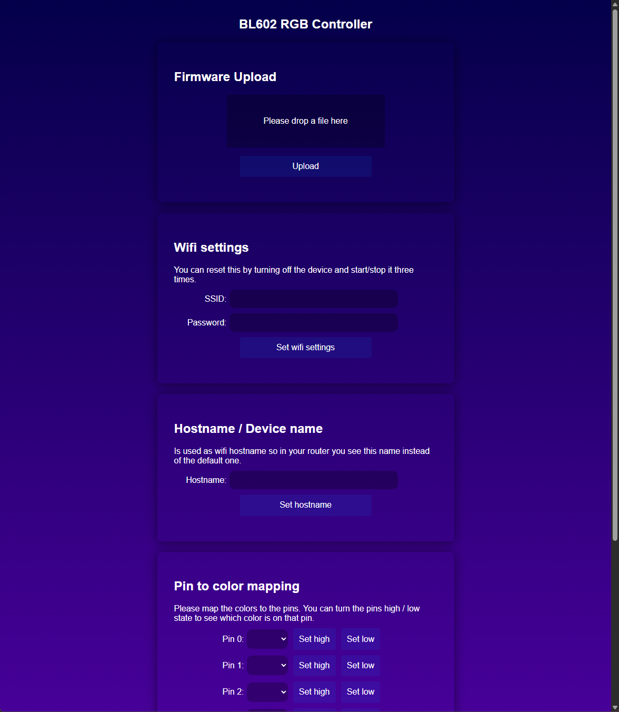
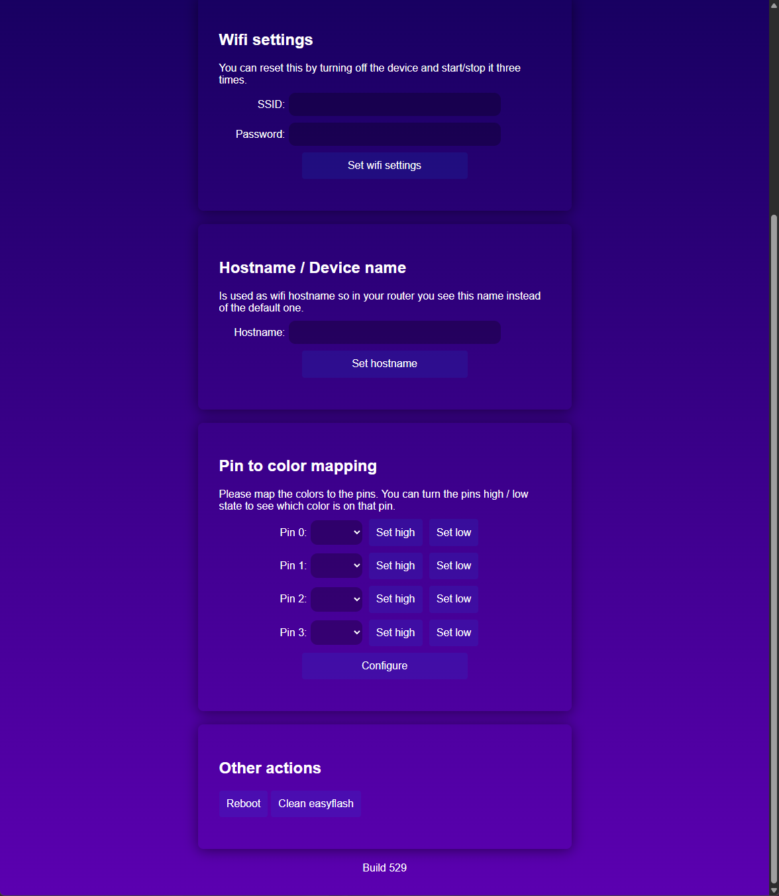
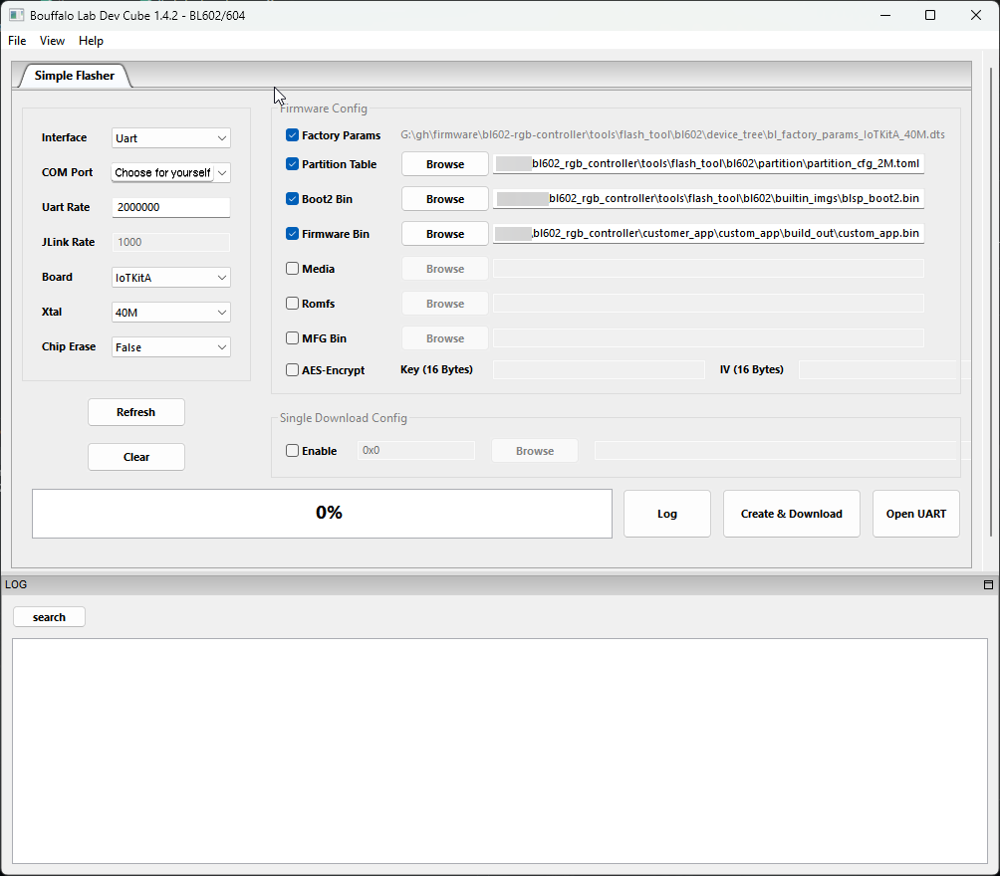

## 🔴🟢🔵 RGB/W Controller Firmware for BL602 🔴🟢🔵
### 📸 Screenshots of WebUI
 

### 📝 Features
- Control RGB/W stripe via http / rest or udp server ([See details](server_defintions.md))
- Pin to color mapping
- Set device hostname (e.g. used in the router)
- Set wifi settings
- Creates a wifi hotspot for initial configuration
- Updates via OTA

## 📥 Downloading the firmware
You can find the several firmware formats in the [release tab](https://github.com/vizualjack/bl602_rgb_controller/releases), depending on your board, firmware and the method you wanna use. 
I will provide one method for installing and updating.

## ⚙️ Installing onto your device via UART (Windows)
📋 **Requirements**: [Downloading the firmware (.bin)](#-downloading-the-firmware) 
### 1. 🔌 **Connecting the board**
**Pins (+ State) you need**: BOOT(**HIGH**), RX, TX, GROUND
#### 📱 **For these boards:** Pine64 BL602 EVB ver 1.1 / Pine64 Pinenut-01S / Boufallo Lab BL602 Dev Module
You should find the needed information here in [this documentation](https://pine64.github.io/bl602-docs/Quickstart_Guide/connecting_the_hardware.html). 
#### 📱 **For other boards**
Depending on the board, you should see all needed connections to the pins marked on the board itself or there is already some connector (e.g usb-c) wired on the board that you can use and a switch to toggle the boot pin state. 
Hopefully you can find a good documentation on how to find these. 
Maybe you also needed some extra devices (e.g serial to usb converter) but this varies from board to board so that's why I can't provide further informations here.

### 2. 🛠️ **Setup the flash tool**
The flash tool can be found here: `.../this/repo/tools/flash_tool` 
This is the recommended flash configuration: 
 
The only setting you need to adjust is the "COM Port". 
To identify the right one I would recommend the device manager, the device should pop up under the **Ports (COM & LPT)** area.

### 3. 🚀 **Flashing**
When everything is connected and the boot pin is set to high, you power up the device and press **Create & Download** button in the flash tool

## 🔄 Updating the firmware
📋 **Requirements**: [Downloading the firmware (.bin.xz)](#-downloading-the-firmware) 
If you wanna update this firmware on your device I would recommend the OTA method you can find under the **Firmware Upload** area which uses the **.bin.xz** format.

## 💻 Development
⚠️Whitespaces in your path / folder names could be mess this up⚠️
### 📦 **Building the firmware**
📋 **Requirements**: [cmake](https://cmake.org/)
#### Windows:
	cd ...\this\repo\customer_app\custom_app
	build.bat
#### Linux / MSYS:
	cd .../this/repo/customer_app/custom_app
	./build
📄 Output firmware file: `.../this/repo/customer_app/custom_app/build_out/custom_app.bin`

### 📦 **Building the OTA versions of the firmware**
📋 **Requirements**: [Python](https://www.python.org/downloads/), [Building the firmware](#-building-the-firmware)
#### Windows:
	cd ...\this\repo\customer_app\custom_app
	build_ota.bat
#### Linux / MSYS:
	cd .../this/repo/customer_app/custom_app
	./build_ota
📄 Output directory: `.../this/repo/customer_app/custom_app/build_out/ota/dts40M_pt2M_boot2release_c84015`